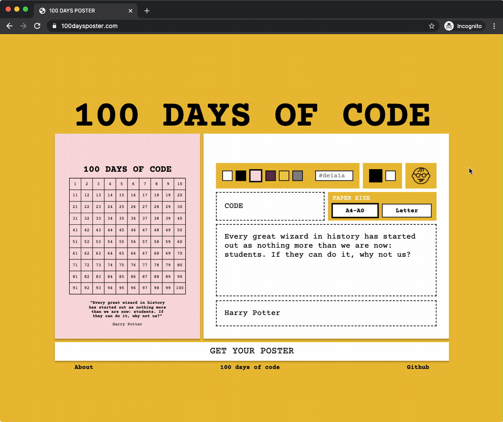

# 100daysposter

> [Website](https://100daysposter.com/) to download a customised 100 days challenge poster as a pdf

Ever came across the [#100daysofcode](https://twitter.com/search?q=%23100daysofcode) challenge? Download a poster with 100 squares, print it out, cross one off every day and [don't break the chain!](https://blog.doist.com/dont-break-the-chain/) Benefits are inclusive of, but not limited to: 

- dopamine hit from physically crossing a day off (it's rather satisfactory 😌)
- visual reminder of your progress and commitment

* * *

💻✅ Supporting most desktop screen sizes  
📱🚫 Mobile support currently not available

## How it works
1️⃣ **Customise your poster and download it**

 

* choose one of the preselected colours or enter a custom colour code for the background
* choose black or white text
* choose to count from 0 (nerd setting)
* insert activity you're commiting to
* choose paper size based on the location of your printing service (Letter for North America, A4 for everywhere else)
* insert a motivational quote
* insert the author of a given quote 

2️⃣ **Print it out and hang it up**

3️⃣ **Cross days off and watch the streak grow** 💪
## Dependencies
* [pdf-lib](https://github.com/Hopding/pdf-lib)
* [cssnano](https://github.com/cssnano/cssnano)
* [parcel-bundler](https://github.com/parcel-bundler/parcel)
* [tslib](https://github.com/Microsoft/tslib)
* [pako](https://github.com/nodeca/pako)
* [typeit](https://github.com/alexmacarthur/typeit)
* [validate-color](https://github.com/dreamyguy/validate-color)

## Run it locally
## License
MIT

